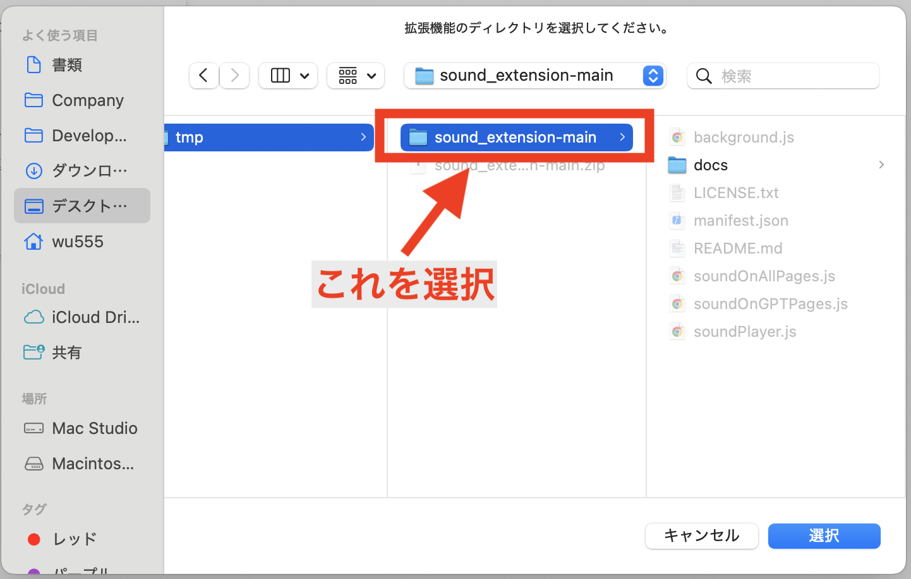

# ロード完了時音声再生アプリ
version 0.0.1 (α)  
試作品です。
## インストール
### 動画(downloadからinstallまで)

### download
```
$ git clone https://github.com/wubw555/sound_extension
```
または、  

上記画像の箇所をクリックして「Download ZIP」をクリックするとzipファイル(sound_extension-main.zip)をダウンロードすることができます。

### install
1. ダウンロードしたZIPファイル(sound_extension-main.zip)を展開します。
2. Chromeを開いて右上「...」メニューから拡張機能->拡張機能を管理をクリックします。

3. 拡張機能の管理ページから「パッケージ化されていない拡張機能を読み込む」をクリック

4. 1.で展開したフォルダを選択(1. で展開したフォルダの中身ではなく1.で展開したフォルダそのもののことです)

5. これで使用の準備ができました！

## 機能
### 1. 全ページロード完了後サウンド再生
[アプリ起動ページ](https://progress-sound.an.r.appspot.com/)  
利用開始前に起動ページで起動ボタンを押す必要があります。  
#### **!使用中は起動ボタンを押した起動ページのタブを消さないでください!**  
他のタブを開いて自由にChromeを使用していただいて問題ありませんが、起動ページタブは常にバックグランドに開いておく必要はあります。

### 2. GPTのトークン生成完了通知
今の所対応しているのは以下の2サイトのみです。  
この機能については起動ページの利用は不要です。

- https://chatgpt.com
- https://claude.ai/chats

トークンの生成が終わると音が再生されます。

### 3. Chrome標準機能でのPDF読み込み完了通知
[アプリ起動ページ](https://progress-sound.an.r.appspot.com/)  
1.と同様、利用開始前に起動ページで起動ボタンを押す必要があります。  
#### **!使用中は起動ボタンを押した起動ページのタブを消さないでください!**  
他のタブを開いて自由にChromeを使用していただいて問題ありませんが、起動ページタブは常にバックグランドに開いておく必要はあります。  
1.と同じ音が鳴ります。

### 4. 免責/ライセンス
本ソフトウェア本体はMITライセンスで提供されています。従って、開発者は本ソフトウェアに対しいかなる保証もせず、使用により生じたいかなる結果についての責任も負いません。 
ただし、音源部分のライセンス及び著作権に関しては、以下をお読みください。  
音源提供：Springin’ Sound Stock  
https://www.springin.org/sound-stock/guideline/

### 5. 補足
アプリ駆動ページについては、音を再生するためにシンプルなボタンをクリックするためのページを用意しているにすぎません。  
カスタマイズする際には任意のWebサイトに置き換えることができます。
